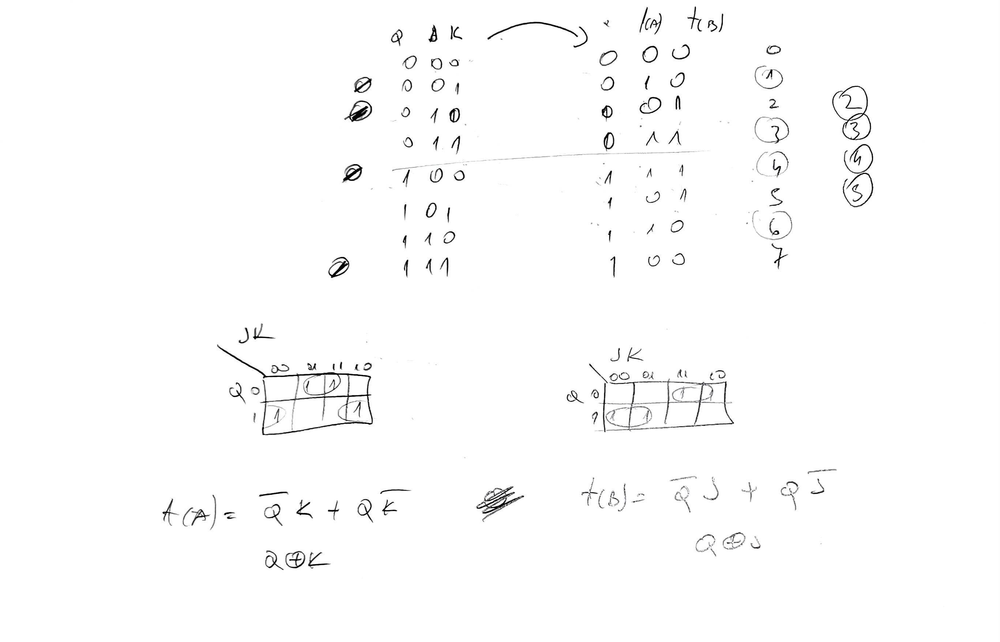
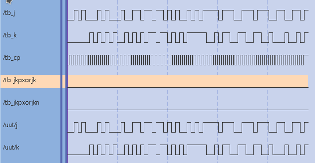
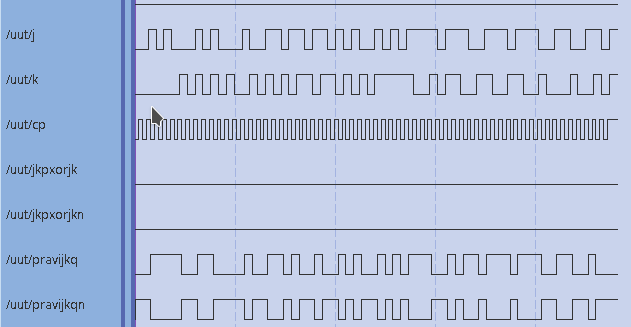
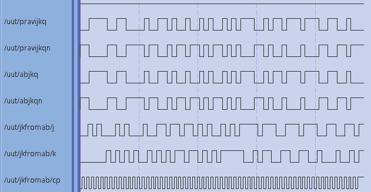

# Laboratorijska vježba 4

## Zadatak
- AB bistabil je zadan, dijagramom, pronađite formulu stanja AB bistabila.
- napišite modelom ponašanja vhdl za AB bistabil
- ostvarite JK bistabil pomoću AB bistabila.

###  AB bistabil
Formulu stanja AB bistabila sam otkrio te sam realizirao AB bistabil prema uputama. Asistent je bio potvrdio da je kod ispravan.
[ab bistabil](ab.vhdl)

## JK bistabil pomoću AB bistabila

### Ideja za ostvarivanje JK bistabila
Nekako po prilici, zbog treme/brzine ili jednostavno zaborava, nikako se nisam mogao sjetiti ili doći do ideje da jednostavno izjednačim formule stanja AB i JK bistabila, pa bi imao rješenje u jednome redu.. međutim u periodu kroz dvadesetak minuta uspio sam doći do rješenja na drukčiji način. Moja ideja je bila "prevesti" instrukcije JK bistabila na instrukcije AB bistabila.

### Ostvarivanje JK bistabila
Tako da sam izveo tablicu kombinacija AB i JK bistabila, te usporedio redove u kojima se razlikuju te u njima zamijenio ulaze / instrukcije tako da AB bistabil prima ulaz koji bi odgovarao ponašanju JK bistabila.
Npr. ukoliko ulaz 01 JK bistabilu znači reset, preveo bi to u ulaz koji resetira AB bistabil, odnosno ulaz 10.

### VHDL JK bistabila
U datoteci [jkbist.vhdl](jkbist.vhdl) ostvario sam na satu JK bistabil, koji je bio funkcionalan, međutim asistent nije bio priznao moje rješenje.

### Testiranje JK bistabila
U datoteci [jkbistxorrealjk.vhdl](jkbistxorrealjk.vhdl) sastavio sam kod koji simulira valjani JK bistabil te također koristi JK bistabil sastavljen od AB bistabila, kojemu daje isti input kao i pravilnom JK bistabilu. Potom s uspoređuje izlaz JK bistabila i JK bistabila ostvarenog AB bistabilom. Čini se kako su izlazi isti.

testbench koji testira [jkbistxorrealjk](jkbistxorrealjk.vhdl).
Prema izlazima `jkpxorjk` i `jkpxorjkn` čini se da nema razlike između pravog JK bistabila i mog JK bistabila ostvarenog pomoću AB bistabila.

### Zaključak
Iako se čini da je moje rješenje bilo točno, ono nije bilo priznato. Zanima me ako je moje rješenje uistinu točno i zašto se ne bi moglo priznati kao ispravno?
